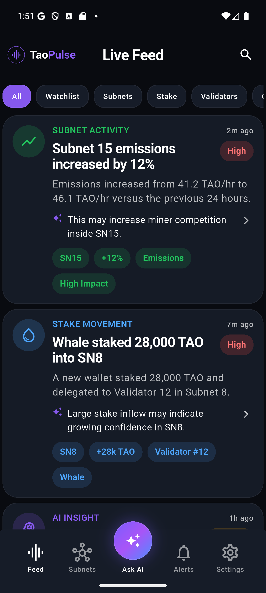
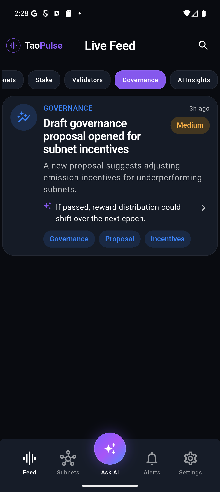
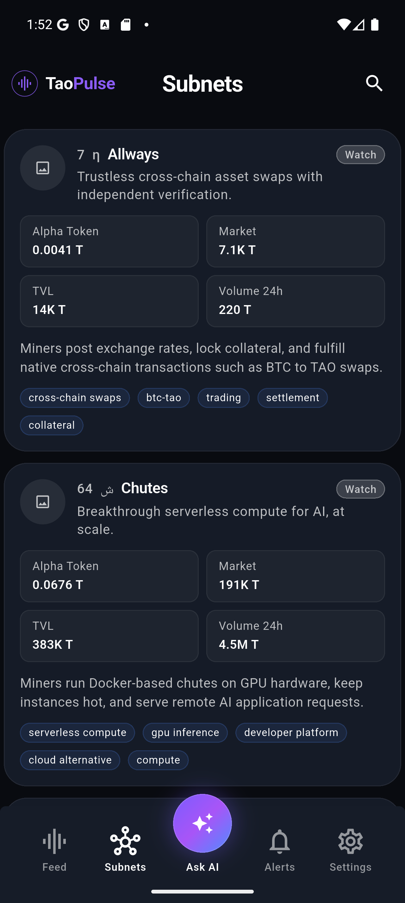
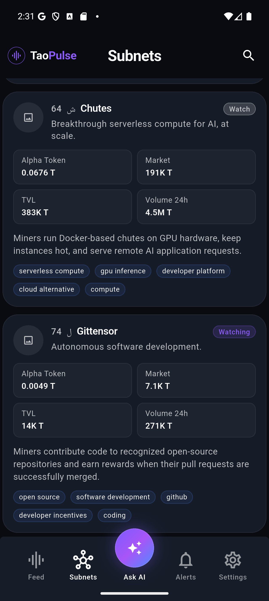
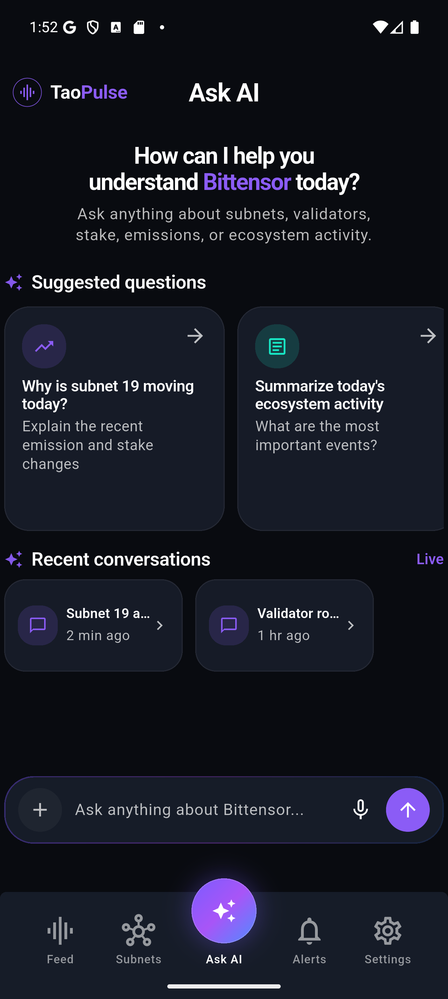
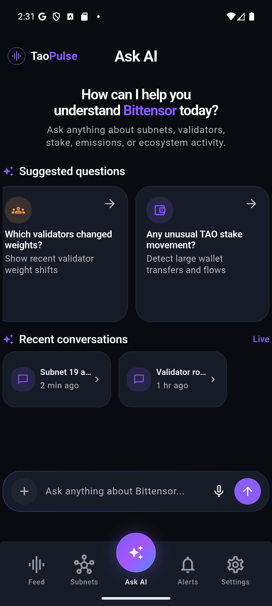
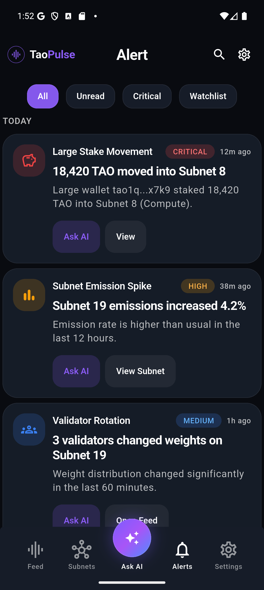
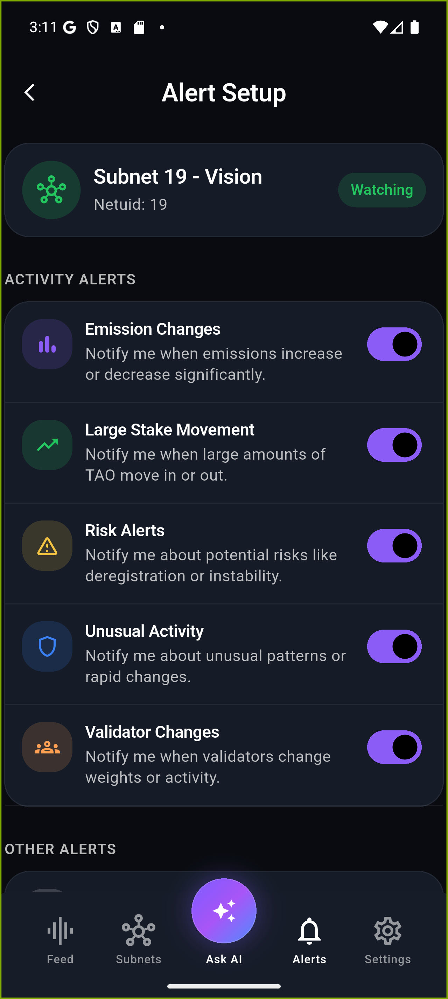
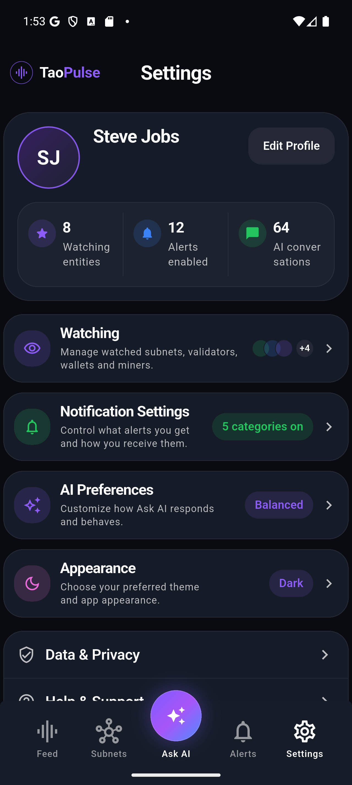
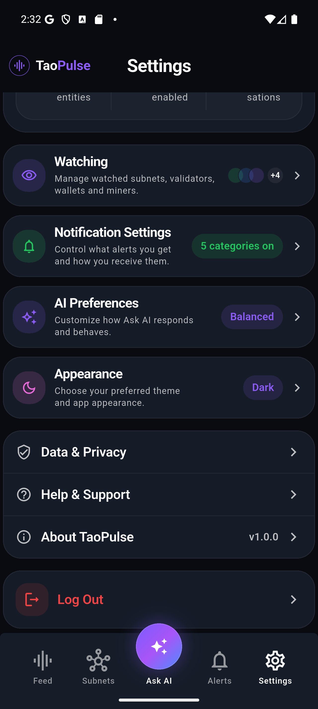

# TaoPulse
An AI-powered mobile app for Bittensor that provides timely, relevant insights and alerts to help users stay on top of important ecosystem signals.

# Vision
Bittensor is difficult to understand and follow in realtime. The ecosystem moves quickly, information is fragmented, and important signals are easy to miss.

TaoPulse aims to surface the most relevant signals, explain why they matter, and help users stay informed through intelligent feeds, alerts, and AI-powered insights.

It should stay clear, calm, and mobile-first: not ad-like, not popup-heavy, and not overloaded with dashboard noise.

# Features

<table style="border-left: 1px solid #30363d; border-right: 1px solid #30363d; border-collapse: collapse;">
  <tr>
    <td width="40%" valign="middle" style="background-color: #0d1117; border-right: 1px solid #30363d; padding: 20px;">
      <h3>Live Feed</h3>
      AI-backed live feed that surfaces the most relevant Bittensor signals for your interests, whether you are evaluating subnets, staking, or mining.
    </td>
    <td width="60%" style="background-color: #0d1117; padding: 20px;">
      <p align="center">
        
        
      </p>
    </td>
  </tr>
  <tr>
    <td width="40%" valign="middle" style="background-color: #161b22; border-right: 1px solid #30363d; padding: 20px;">
      <h3>Subnets</h3>
      Helps users understand, compare, and follow Bittensor subnets with concise descriptions, key metrics, and deeper context.
    </td>
    <td width="60%" style="background-color: #161b22; padding: 20px;">
      <p align="center">
        
        
      </p>
    </td>
  </tr>
  <tr>
    <td width="40%" valign="middle" style="background-color: #0d1117; border-right: 1px solid #30363d; padding: 20px;">
      <h3>Ask AI</h3>
      Helps users understand Bittensor activity through plain-language questions and concise AI explanations.
    </td>
    <td width="60%" style="background-color: #0d1117; padding: 20px;">
      <p align="center">
        
        
      </p>
    </td>
  </tr>
  <tr>
    <td width="40%" valign="middle" style="background-color: #161b22; border-right: 1px solid #30363d; padding: 20px;">
      <h3>Alerts</h3>
      Helps users stay on top of important subnet events and control which activity triggers notifications.
    </td>
    <td width="60%" style="background-color: #161b22; padding: 20px;">
      <p align="center">
        
        
      </p>
    </td>
  </tr>
  <tr>
    <td width="40%" valign="middle" style="background-color: #0d1117; border-right: 1px solid #30363d; padding: 20px;">
      <h3>Settings</h3>
      Helps users manage subnet watchlists, alert settings, AI preferences, profile settings, and appearance in one place.
    </td>
    <td width="60%" style="background-color: #0d1117; padding: 20px;">
      <p align="center">
        
        
      </p>
    </td>
  </tr>
</table>

# Roadmap

1. **Feed & Signal Quality**: Improve live feed relevance, prioritization, and signal quality.
2. **Subnets**: Expand subnet coverage and improve subnet metadata and comparison signals.
3. **AI & Insights**: Strengthen Ask AI context awareness, explanations, and source-aware responses.
4. **Alerts & Watchlists**: Improve alert prioritization, watchlist workflows, and notification clarity.
5. **Mobile UX**: Improve mobile-first usability, responsiveness, and information clarity.
6. **Infrastructure & Backend**: Evolve the backend from mock-driven development toward more production-ready data pipelines and ingestion workflows.

# Architecture

TaoPulse uses a feature-first Flutter app structure with shared app, core, and UI layers.

```text
lib/
├── app/                  # app entry, shell, and routing
├── core/                 # theme, networking, storage, and core utilities
├── features/
│   └── <feature>/
│       ├── data/         # repositories and data sources
│       ├── models/       # feature models
│       └── presentation/ # screens, view models, and widgets
├── shared/               # shared widgets and UI helpers
└── main.dart
```

Most product areas follow the same pattern: feature data lives in `data/`, UI and state live in `presentation/`, and reusable app-wide pieces live in `core/` or `shared/`.

Dependency flow:

```text
Screens / UI -> Providers / view models -> Repositories -> API client
```

Riverpod is used to inject app routing, repositories, and feature state.

# Contributing
See [CONTRIBUTING.md](CONTRIBUTING.md) for contribution guidelines and development setup.

# License

This project is licensed under the [GNU AGPL-3.0](LICENSE).

Copyright (c) 2026 cogniax.
